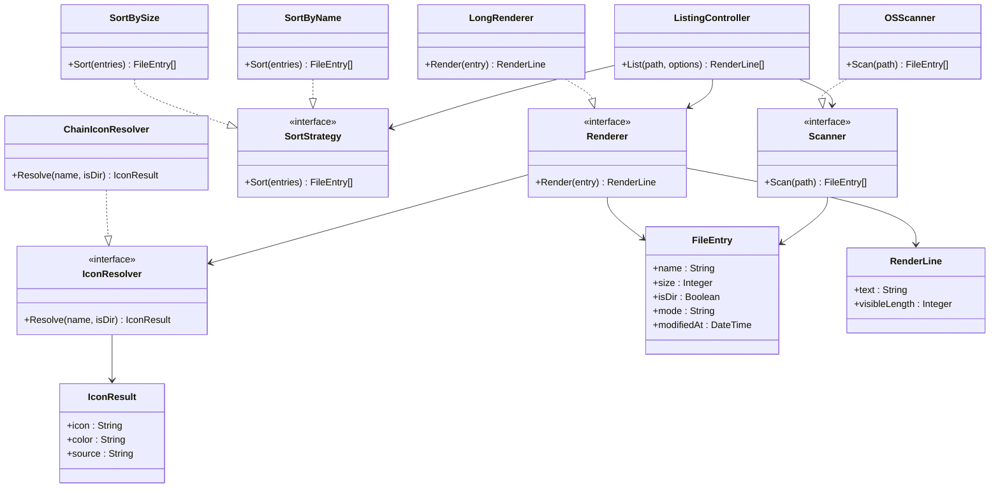

# Specification informelle et semi-formelle

## 1. Contexte et objectif

Le logiciel lm est un utilitaire en ligne de commande qui affiche le contenu d un repertoire, de maniere lisible et rapide, avec enrichissement visuel (icones, couleurs, informations de taille, date et permissions). L objectif principal est de proposer une alternative simple a ls, tout en restant extensible pour des besoins futurs: nouveaux formats d affichage, nouvelles strategies de tri et nouvelles regles d interpretation des fichiers.

## 2. Specification informelle des fonctionnalites principales

### F1. Lister les entrees d un repertoire

L utilisateur fournit un chemin (ou utilise le repertoire courant). Le systeme recupere les entrees du repertoire et affiche les informations pertinentes pour chaque element.

### F2. Afficher des metadonnees utiles

Pour chaque entree, le systeme affiche:

- le mode (permissions)
- la date de modification
- la taille (formattee)
- le nom
- un indicateur visuel (icone + couleur)

### F3. Distinguer repertoires et fichiers

Les repertoires sont identifies explicitement et peuvent etre affiches avec un style specifique. Les fichiers executables sont egalement identifies.

### F4. Associer une icone selon le type

Le systeme determine une icone a partir:

- du nom exact (cas speciaux: Makefile, Dockerfile, etc.)
- du motif de test
- de l extension
- d une valeur par defaut si aucun cas ne correspond

### F5. Supporter l extensibilite

L architecture doit permettre d ajouter sans casser le code existant:

- un nouveau mode de tri
- un nouveau mode de rendu
- une nouvelle regle d icone

### F6. Gerer les erreurs de maniere claire

Si le chemin est invalide ou inaccessible, le systeme retourne un message explicite sans plantage brutal pour l utilisateur final.

## 3. Exigences non fonctionnelles

- Performance: affichage reactif pour les repertoires de taille moyenne.
- Portabilite: minimiser les dependances specifiques plateforme.
- Maintenabilite: responsabilites separees (scan, tri, rendu, icones).
- Testabilite: logique metier testable sans I O terminal direct.

## 4. Specification semi-formelle

### 4.1 Acteur

- Acteur principal: Utilisateur CLI

### 4.2 Cas d utilisation principaux

#### UC1 - Lister un repertoire

- Precondition: un chemin est fourni ou le repertoire courant est disponible.
- Flux nominal:
  1. L utilisateur lance la commande.
  2. Le controleur valide la requete.
  3. Le scanner lit les entrees.
  4. Le tri est applique.
  5. Le renderer produit les lignes.
  6. Le resultat est affiche.
- Postcondition: une liste formatee est produite.

#### UC2 - Choisir un mode de tri

- Precondition: une strategie de tri est disponible.
- Flux nominal:
  1. L utilisateur selectionne un critere.
  2. Le systeme applique la strategie correspondante.
- Postcondition: ordre de sortie coherent avec le critere choisi.

#### UC3 - Resoudre une icone pour une entree

- Precondition: le nom de fichier est connu.
- Flux nominal:
  1. Verification des cas speciaux.
  2. Verification motif test.
  3. Verification extension.
  4. Fallback inconnu.
- Postcondition: un couple (icone, couleur) valide est retourne.

### 4.3 Regles metier

- RM1: La taille affichee d un repertoire est 0 ou vide selon le mode de rendu.
- RM2: Toute entree doit avoir un nom non vide.
- RM3: Toute entree affichee doit posseder une icone resolue.
- RM4: Le controleur ne depend pas directement des details I O OS (via interfaces).

### 4.4 Contrats OCL (semi-formel)

```ocl
context FileEntry
inv NonNegativeSize: self.size >= 0

context FileEntry
inv NonEmptyName: self.name.size() > 0

context FileEntry
inv DirectorySizePolicy: self.isDir implies self.size = 0

context IconResult
inv NonEmptyIcon: self.icon.size() > 0

context ListingController::list(path : String)
pre ValidPathArg: path.size() > 0

context ListingController::list(path : String)
post NonNullResult: result <> null and result->size() >= 0
```

## 5. Diagramme de classes initial

Le diagramme ci dessous decrit une architecture initiale cible, compatible avec les principes de modularite (SOLID/GRASP) et les patterns envisages.



## 6. Limite de la specification

Cette specification couvre les fonctionnalites coeur du logiciel et l architecture initiale. Les options avancees (mode arbre, export JSON, filtrage complexe) peuvent etre specifiees dans une version iterative ulterieure.
